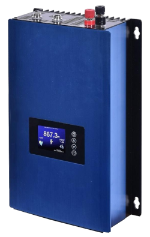
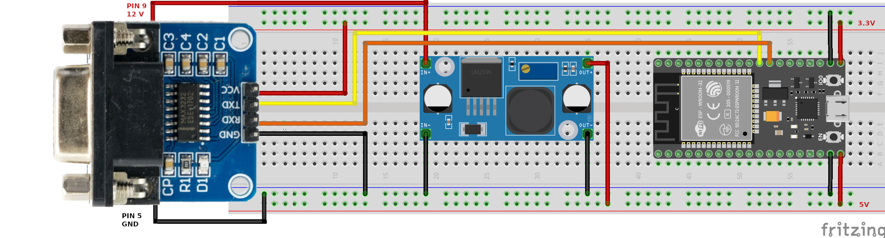
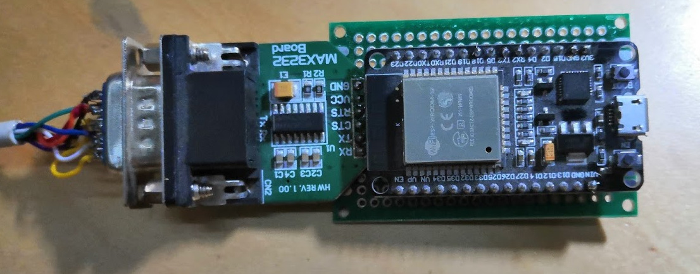
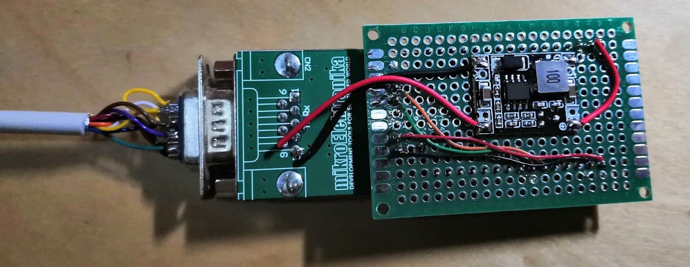

# GridFree SUN-2000G inverter
ESP32 library for reading data from GridFree SUN-2000G inverter.

Tested on ESP32 (ESP-WROOM-32).

Suppored devices:
* [GridFree SUN-2000G](https://shop.gwl.eu/GridFree-Inverters/GridFree-AC-Inverter-with-limiter-2kW-SUN-2000G-45-90V.html)




# ESP32
Components:
- RS232 <-> TTL converter
- Stepdown power module (12V -> 5V)




## Photos




# ESPHome
This is eaxample of integration with ESPHome.

## `esphome/config/GFSunInverter.h`
```c
#include "esphome.h"
#include <GfSun2000.h>


class GfSun2000Sensor : public PollingComponent, public Sensor, public GfSun2000Callback {
 public:
  GfSun2000 gf = GfSun2000();
  Sensor *ac_voltage = new Sensor();
  Sensor *dc_voltage = new Sensor();
  Sensor *power = new Sensor();
  Sensor *energy = new Sensor();
  // constructor
  GfSun2000Sensor() : PollingComponent(5000) {}

  void errorHandler(int errorId, char* errorMessage) {
      ESP_LOGD("ERROR", "Error response: %02X - %s\n", errorId, errorMessage);
  }

  void dataHandler(GfSun2000Data data) {             
     ac_voltage->publish_state((long)data.ACVoltage);
     dc_voltage->publish_state((long)data.DCVoltage);
     power->publish_state((long)data.averagePower);       
     energy->publish_state((long)data.totalEnergyCounter);
  }


  void setup() override {
    gf.setup(Serial2);
    gf.setObjectHandler(this);
  }

  void update() override {
    gf.readData();    
  }
};


```

## the ESPHome yaml definition

```yaml
substitutions:
  patform: "esp32"
  board: "esp32doit-devkit-v1"
  device_name: solar01
  comment: "Solar panels"
  tx_pin: "17"
  rx_pin: "16"
  baud_rate: "9600"
  ip: "192.168.168.168"

esphome:
  name: '${device_name}' 
  comment: '${comment}'  
  platform: '${patform}'
  board: "${board}"

  libraries:
    - https://github.com/eModbus/eModbus.git#v1.0-stable
    - https://github.com/BlackSmith/GFSunInverter.git@v1.1.0
  includes:
    - GFSunInverter.h

# Enable logging
logger:
  level: INFO


ota:
  password: "generated-ota-password"

wifi:
  use_address: "${ip}"
  ssid: !secret wifi_ssid
  password: !secret wifi_password

  # Enable fallback hotspot (captive portal) in case wifi connection fails
  ap:
    ssid: "Solar Fallback Hotspot"
    password: "generated-wifi-fallback-password"

mqtt:
  broker: 192.168.168.100
  username: mqtt_user
  password: !secret mqtt_password
  reboot_timeout: 1min


sensor:
  - platform: custom
    lambda: |-
      auto gf = new GfSun2000Sensor();      
      App.register_component(gf);
      return {
        gf->ac_voltage, 
        gf->dc_voltage, 
        gf->power,
        gf->energy        
      };
    sensors:
      - name: "${device_name} AC Voltage"
        id: "${device_name}_ac_voltage"       
        device_class: voltage
        state_class: measurement
        unit_of_measurement: V
        accuracy_decimals: 1
        force_update: true
        
      - name: "${device_name} DC Voltage"
        id: "${device_name}_dc_voltage"
        device_class: voltage
        state_class: measurement
        unit_of_measurement: V
        accuracy_decimals: 1
        force_update: true

      - name: "${device_name} Power"
        id: "${device_name}_power"
        device_class: power
        state_class: measurement
        unit_of_measurement: W
        accuracy_decimals: 2
        force_update: true

      - name: "${device_name} Total Energy"
        id: "${device_name}_total_energy"        
        device_class: energy
        state_class: measurement
        unit_of_measurement: kwh
        accuracy_decimals: 2
        force_update: true
```